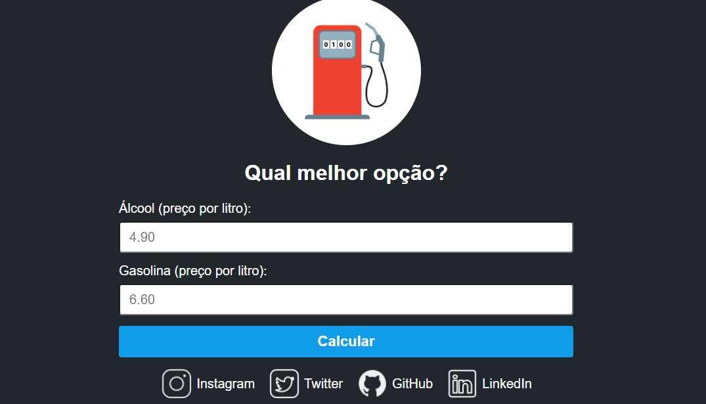

# Calculadora-Gasolina-ou--Alcool
Projeto desenvolvido no evento do Sujeito Programador

# Sujeito Programador

Projeto construído do evento Sujeito Programador.

[🔗 Clique aqui para acessar](https://jrodrygues.github.io/Calculadora-Gasolina-ou--Alcool/)

## 🛠 Tecnologias

- HTML
- CSS
- Git e Github

## 💛 Contato

📧 jesserodrygues.jr@gmail.com
📱 14 991136982
